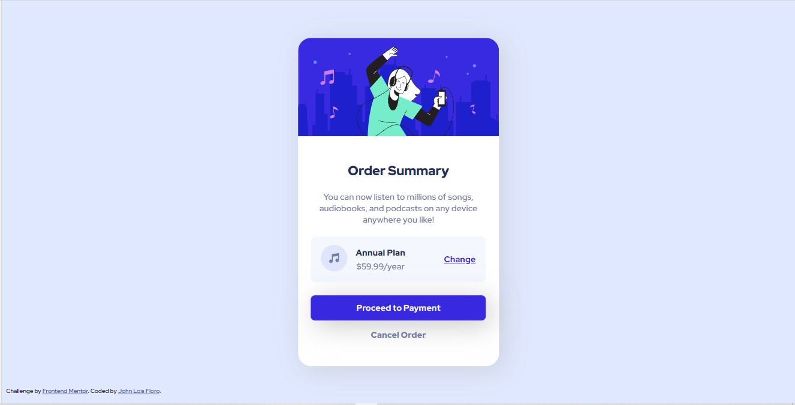

# Frontend Mentor - Order summary card solution

This is a solution to the [Order summary card challenge on Frontend Mentor](https://www.frontendmentor.io/challenges/order-summary-component-QlPmajDUj). Frontend Mentor challenges help you improve your coding skills by building realistic projects. 

## Table of contents

- [Overview](#overview)
  - [The challenge](#the-challenge)
  - [Screenshot](#screenshot)
  - [Links](#links)
- [My process](#my-process)
  - [Built with](#built-with)
  - [What I learned](#what-i-learned)
  - [Continued development](#continued-development)
  - [Useful resources](#useful-resources)
- [Author](#author)
- [Acknowledgments](#acknowledgments)


## Overview

### The challenge

Users should be able to:

- See hover states for interactive elements

### Screenshot



### Links

- Solution URL: [Github] (https://github.com/loifloro/order-summary-component)
- Live Site URL: [Add live site URL here](https://your-live-site-url.com)

## My process

### Built with

- Semantic HTML5 markup
- CSS custom properties
- Flexbox
- CSS Grid
- SCSS 

### What I learned

Its my first time using SCSS and Im still getting used to it. My nesting isnt quite actually good and needs a lot of practice. Hopefully on the next challenge it will be good. 

To see how you can add code snippets, see below:

```scss
$primary-color-1: hsl(225, 100%, 94%);
$primary-color-2: hsl(245, 75%, 52%);
$text-1: hsl(223, 47%, 23%);
$text-2: hsl(224, 23%, 55%);
$text-3: hsl(225, 100%, 98%);
```

### Continued development

Definitely I want to practiced more about nesting a variables of SCSS. My method of center divs is through position absolute and tranform, I hope I can improve on this things next challenge. Also on box-shadow I cant quite grasp it. 

### Useful resources

- [Youtube](https://www.youtube.com/watch?v=_a5j7KoflTs) -This is the video I watch from FreeCodeCamp, discussing the fundamentals of SCSS

## Author

- Website - [John Lois Floro](https://www.your-site.com)
- Frontend Mentor - [@loifloro](https://www.frontendmentor.io/profile/loifloro)
- Twitter - [@dumb_loixx](https://www.twitter.com/@dumb_loixx)

## Acknowledgments

I made this alone, its also my second Frontend Mentor challenge. I recorded the time I started, I think I finished this in 4 hours ,is bad for beginner?

